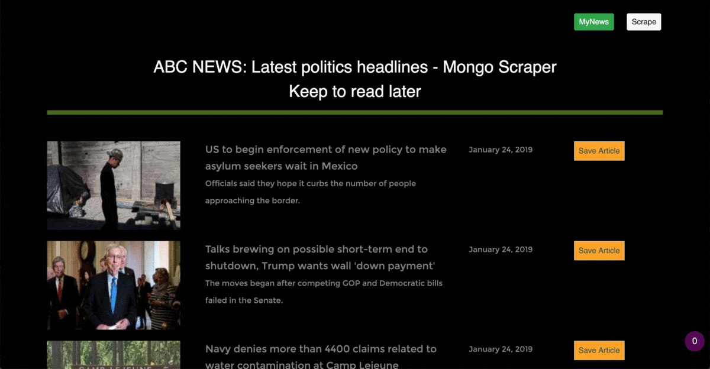

# ABC News Scrapper

## Overview

In this project, I am using Node, Express, Handlebars, Cheerio, Express-handlebar, MongoDB, Mongoose, Body-parser, Cheerio, Request. Deployed in Heroku.

Try the app here: 

## Getting Started

#### These instructions will get you a copy of the project up and running on your local machine.

1. Clone the repository
2. Run nmp install 

## Built With

- Html
- Bootstrap
- Javascript
- Jquery
- MongoDB
- Mongoose
- Nodejs
- Express
- Handlebars

## Screenshots

## Comments

In this project was important:
- 
- 
- 

## Author

Isabel Arcones: https://github.com/iarcones

Here I will be updating some samples of my projects: https://iarcones.github.io/

